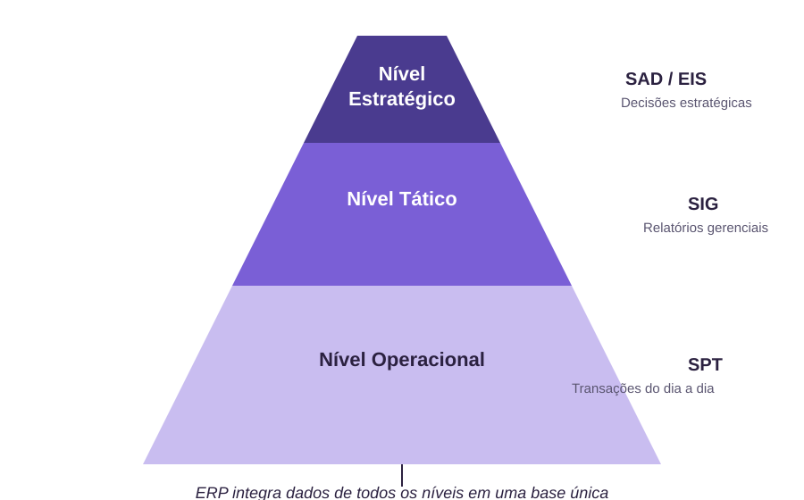
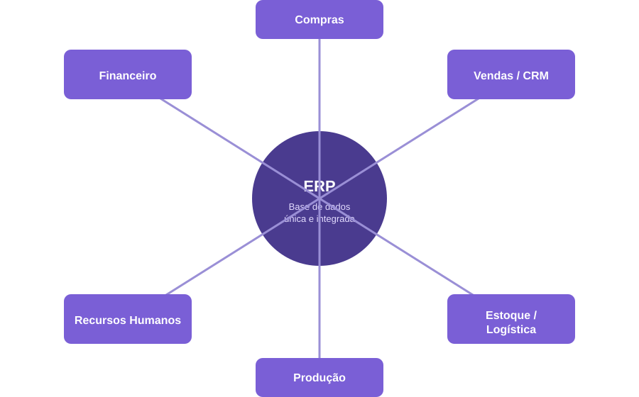

<!-- _class: lead -->
<!-- _paginate: false -->

# Desenvolvimento de Sistemas Corporativos

### Semana 1 — Apresentação da disciplina e Unidade 1
Sistemas de Informação Gerenciais, Sistemas de Apoio à Decisão e ERP

Curso Superior de Tecnologia em Sistemas para Internet

---

## Agenda da semana

1. Apresentação da disciplina (ementa, metodologia, avaliação)
2. O que é um Sistema Corporativo?
3. Sistemas de Informação Gerenciais (SIG)
4. Sistemas de Apoio à Decisão (SAD)
5. Enterprise Resource Planning (ERP)
6. Comparativo e exemplos de mercado
7. Curiosidade histórica e síntese da semana

---

<!-- _class: lead -->

# Parte 1
## Apresentação da disciplina

---

## Sobre a disciplina

- **Carga-horária:** 60h (80h/a) — 4 créditos
- **Pré-requisito:** Desenvolvimento Web Back-end
- **Encontros:** quartas e sextas-feiras, 2 aulas de 45 min por encontro
- **Propósito:** consolidar, na prática, os conhecimentos de back-end avançando para os desafios reais de aplicações corporativas
- **Linguagem e framework do semestre:** **Java** com **Spring Boot**

> Arquitetura em camadas, persistência via ORM, segurança, integração via web services e geração de relatórios — tudo construído com o ecossistema Spring.

---

## Objetivos da disciplina

- Compreender os conceitos fundamentais que embasam o desenvolvimento de **sistemas corporativos**;
- Desenvolver sistemas corporativos com **todas as características necessárias**:
  - arquitetura;
  - persistência;
  - segurança;
  - integração (APIs/web services);
  - geração de relatórios.

---

## Metodologia

- Aulas teóricas expositivas dialogadas
- Aulas práticas em laboratório
- Seminários
- **Projeto corporativo** desenvolvido ao longo do semestre, com entregas incrementais e apresentação final

**Stack adotada no semestre:** **Java + Spring Boot**, com Spring Data JPA (persistência), Spring Security (segurança) e Spring MVC/Spring Web (APIs REST) — o mesmo ecossistema será usado do primeiro exercício ao projeto final.

---

## Avaliação

| Instrumento | Conteúdo | Peso |
|---|---|---|
| Avaliação 1 (teórica) | Unidades 1 a 3.6 | 25% |
| Avaliação 2 (teórica) | Unidades 3.7 a 3.11 | 25% |
| Projeto corporativo (prático, em equipe) | Arquitetura, persistência, segurança, API, relatórios | 35% |
| Listas de exercícios e estudos dirigidos | Ao longo do semestre | 15% |

---

## Panorama do semestre

- **Unidade 1** — Introdução aos Sistemas Corporativos *(hoje)*
- **Unidade 2** — Servidores de Aplicações Corporativas
- **Unidade 3** — Elementos de uma Aplicação Corporativa (arquitetura, persistência, segurança, DW/BI, transações, web services, APIs, autenticação, WebSockets)
- **Unidade 4** — Desenvolvimento utilizando Frameworks (componentes distribuídos, relatórios)
- **Projeto corporativo final** — consolidação de tudo em uma aplicação real

---

## Bibliografia básica

1. WEISSMANN, H. *Vire o Jogo com Spring Framework*. Casa do Código, 2012.
2. WALLS, C. *Spring in Action*. 5. ed. Manning Publications, 2019.
3. LAUDON, J. P.; LAUDON, K. C. *Sistemas de Informações Gerenciais*. 11. ed. Pearson, 2014.
4. WETHERBEE, J. et al. *Beginning EJB in Java EE 8*. 3. ed. Apress, 2018.

Complementar: JENDROCK, E. et al. *The Java EE Tutorial*; documentação oficial Spring (spring.io/guides).

---

<!-- _class: lead -->

# Parte 2
## Unidade 1 — Introdução aos Sistemas Corporativos

---

## O que é um Sistema Corporativo?

Um **sistema corporativo** (*enterprise system*) é uma aplicação que dá suporte aos processos de negócio de uma organização, integrando dados e atividades entre diferentes setores.

**Características centrais:**
- Suporta **múltiplos usuários** e **múltiplos processos** simultaneamente
- Lida com **grandes volumes de dados** de forma consistente
- Precisa de **segurança**, **integridade** e **disponibilidade**
- Frequentemente **integra-se** a outros sistemas (via APIs, filas, arquivos)

---

## A pirâmide dos sistemas de informação



---

## Nível Operacional — SPT

**Sistemas de Processamento de Transações (SPT)**

- Registram as operações rotineiras do negócio: uma venda, um pagamento, uma matrícula
- Alto volume, baixa complexidade analítica por transação
- Exemplo prático: um checkout de e-commerce gravando um pedido no banco de dados

> Curiosidade: os primeiros SPTs corporativos, nos anos 1950–60, rodavam em *mainframes* e processavam transações em lote (*batch*), não em tempo real como hoje.

---

## Um SPT em código: Spring Boot

Registrar um pedido — uma transação típica de SPT — expressa como um endpoint REST em Spring Boot:

```java
@RestController
@RequestMapping("/pedidos")
public class PedidoController {

    private final PedidoService pedidoService;

    @PostMapping
    public ResponseEntity<Pedido> registrar(@RequestBody Pedido pedido) {
        Pedido salvo = pedidoService.registrar(pedido);
        return ResponseEntity.status(201).body(salvo);
    }
}
```

> Este é o tipo de código que construiremos, evoluiremos e integraremos ao longo do semestre.

---

## Nível Tático — SIG

**Sistemas de Informação Gerenciais (SIG)**

- Consolidam dados operacionais em **relatórios** para gerentes intermediários
- Respondem perguntas como: *"Quais produtos mais venderam este mês por região?"*
- Baseiam-se em dados **estruturados e históricos**

**Exemplo prático:** um painel semanal de vendas por filial, gerado a partir dos pedidos registrados pelo SPT.

---

## Nível Estratégico — SAD

**Sistemas de Apoio à Decisão (SAD)**

- Auxiliam a **alta gestão** em decisões não estruturadas e de longo prazo
- Trabalham com simulações, cenários e modelos analíticos
- Frequentemente combinam dados internos e externos (mercado, concorrência)

**Exemplo prático:** simular o impacto de abrir uma nova filial em diferentes cidades, cruzando dados de vendas, demografia e logística.

---

## Comparativo: SPT × SIG × SAD

| Aspecto | SPT | SIG | SAD |
|---|---|---|---|
| Usuário típico | Operacional | Gerência média | Alta direção |
| Tipo de decisão | Estruturada, rotineira | Semiestruturada | Não estruturada |
| Horizonte de tempo | Imediato | Curto/médio prazo | Longo prazo |
| Fonte de dados | Transações do sistema | SPT consolidado | SIG + dados externos |
| Exemplo | Registrar um pedido | Relatório mensal de vendas | Simulação de expansão |

---

## Enterprise Resource Planning (ERP)

Um **ERP** é um sistema corporativo que **integra em uma única base de dados** os processos de diferentes áreas da empresa, eliminando ilhas de informação isoladas.

**Ideia central:** um evento de negócio (ex.: uma venda) atualiza automaticamente estoque, financeiro e produção — sem retrabalho manual entre sistemas.

---

## Como um ERP se organiza



---

## ERP na prática

Quando um pedido de venda é registrado no módulo de Vendas:

1. O **Estoque** é baixado automaticamente
2. O **Financeiro** gera o título a receber
3. Se o produto ficar abaixo do mínimo, o módulo de **Compras** pode disparar uma requisição
4. A **Produção** recebe a demanda para reposição, se aplicável

> Um único evento de negócio, vários módulos atualizados — essa é a proposta central de integração de um ERP.

---

## Exemplos de mercado

| ERP | Origem | Perfil | Observação |
|---|---|---|---|
| **SAP** | Alemanha (1972) | Grandes corporações | Um dos ERPs mais usados no mundo; forte em processos complexos |
| **TOTVS** | Brasil (1983) | Empresas de todos os portes | Maior fornecedora de ERP do Brasil; forte aderência à legislação nacional |
| **Odoo** | Bélgica (2005) | PMEs, projetos customizados | Código aberto, modular, popular em implementações menores e didáticas |

---

## Curiosidade: do MRP ao ERP

- **Anos 1960–70:** surgem os sistemas **MRP** (*Material Requirements Planning*), focados em planejar materiais de produção
- **Anos 1980:** evoluem para **MRP II**, incorporando planejamento de capacidade e finanças
- **Anos 1990:** o termo **ERP** é popularizado pelo Gartner Group, ampliando o escopo para toda a empresa
- **Hoje:** ERPs em nuvem (SaaS) e com módulos de inteligência artificial embutidos

---

## Curiosidade: por que Spring Boot?

- O **Spring Framework** (2003) já era o padrão de mercado para Java corporativo, mas exigia bastante configuração manual (XML, *beans*, servidores externos)
- Em **2014**, a Pivotal lançou o **Spring Boot**, com **autoconfiguração** e servidor **embutido** (Tomcat por padrão) — reduzindo drasticamente o tempo entre "começar o projeto" e "primeira API funcionando"
- Hoje é a base de sistemas corporativos em bancos, varejo e governo — inclusive parte do ecossistema usado por grandes ERPs corporativos com backend em Java

---

## SIG, SAD e ERP: como se relacionam?

- O **ERP** é a base transacional e integradora (frequentemente atua também como SPT)
- Sobre os dados do ERP, constroem-se **SIGs** (relatórios gerenciais)
- E, a partir dos SIGs, alimentam-se os **SADs** (simulações e decisões estratégicas)

> Na prática de mercado, um mesmo produto (ex.: SAP) pode oferecer módulos que cobrem os três níveis.

---

## Atividade em sala

Em duplas, discutam e anotem:

1. Cite um exemplo do seu cotidiano (universidade, comércio, serviço público) que poderia ser descrito como SPT, SIG ou SAD.
2. Se vocês fossem desenvolver um pequeno ERP para uma padaria, quais módulos mínimos vocês integrariam?
3. Qual a vantagem de ter uma **base de dados única** em vez de sistemas isolados por setor?
4. Pensando no endpoint `/pedidos` visto nesta aula: quais outras entidades (classes Java) esse pequeno ERP provavelmente precisaria, além de `Pedido`?

---

## Síntese da semana

- Sistemas corporativos suportam processos de negócio com múltiplos usuários, segurança e integração
- **SPT → SIG → SAD**: do dado bruto à decisão estratégica
- **ERP**: integra processos e dados de diferentes áreas em uma base única
- Mercado: SAP, TOTVS e Odoo representam perfis distintos de ERP
- A partir de agora, todo o desenvolvimento prático da disciplina será feito em **Java com Spring Boot**

---

<!-- _class: lead -->

# Próxima semana

## Unidade 2 — Servidores de Aplicações Corporativas
Tomcat, WildFly, GlassFish e o servidor embarcado do Spring Boot
