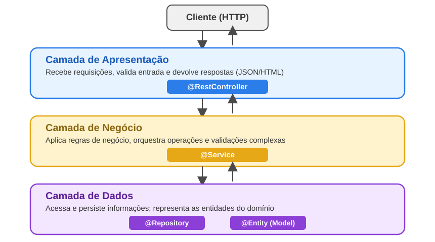
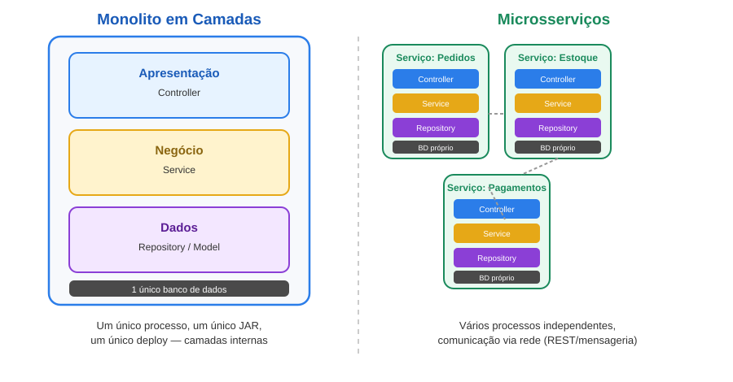

<!-- _class: lead -->

# Desenvolvimento de Sistemas Corporativos

## Semana 3 — Arquitetura de Aplicações Corporativas e Camadas de uma Aplicação Web

Curso Superior de Tecnologia em Sistemas para Internet

---

## Recapitulando a Semana 2

Na aula anterior vimos:

- O papel de um **servidor de aplicação** na execução de sistemas corporativos;
- A diferença entre servidores **tradicionais** (WildFly, GlassFish) e o modelo **embarcado** do Spring Boot;
- Por que o Spring Boot empacota o Tomcat dentro do próprio JAR executável (**fat JAR**).

<br>

Hoje avançamos para dentro da aplicação: **como ela é organizada internamente.**

---

## Objetivos da aula

Ao final desta aula, o estudante será capaz de:

1. Explicar o conceito de **arquitetura de uma aplicação corporativa** e por que ela importa;
2. Identificar as **três camadas clássicas** de uma aplicação web (apresentação, negócio e dados);
3. Mapear cada camada para os componentes correspondentes de um projeto **Spring Boot 4** (`controller`, `service`, `repository`, `model`);
4. Comparar a organização em camadas com as abordagens de **monolito** e **microsserviços**.

---

## 3.1 — O que é Arquitetura de uma Aplicação?

**Arquitetura de software** é o conjunto de decisões estruturais que definem como um sistema é organizado: quais partes existem, o que cada uma faz e como elas se comunicam.

Sem arquitetura definida, um projeto tende a virar um emaranhado onde tudo depende de tudo — o código que lê o JSON da requisição, valida CPF e grava no banco, tudo dentro do mesmo método.

<div class="alerta">
<b>Consequência prática:</b> qualquer alteração pequena (ex.: mudar uma regra de desconto) arrisca quebrar partes não relacionadas do sistema, como a geração de relatórios ou a autenticação.
</div>

---

## Curiosidade — "Big Ball of Mud"

<div class="curiosidade">
Em 1997, Brian Foote e Joseph Yoder cunharam o termo <b>"Big Ball of Mud"</b> para descrever sistemas sem arquitetura definida: código espaguete, estruturado apenas por conveniência de curto prazo, onde tudo se conecta a tudo.
</div>

É, segundo os próprios autores, o **padrão de arquitetura mais comum na indústria** — não porque seja bom, mas porque surge naturalmente quando ninguém decide conscientemente como organizar o sistema.

**A arquitetura em camadas existe justamente para evitar esse cenário.**

---

# Video - Big Ball of Mud

**What is Big Ball of Mud Software Architecture?**

🔗 https://youtu.be/Ygc7Z8UGLhc

---

## 3.2 — As Três Camadas Clássicas

Toda aplicação corporativa, independentemente da linguagem, tende a separar suas responsabilidades em três grandes grupos:

<div class="columns-3">
<div class="box" style="background-color:#e7f3ff;">
<b>🖥️ Apresentação</b><br>
Recebe requisições e devolve respostas. "A porta de entrada."
</div>
<div class="box" style="background-color:#fff3cd;">
<b>⚙️ Negócio</b><br>
Aplica as regras da aplicação. "O cérebro."
</div>
<div class="box" style="background-color:#f3e7ff;">
<b>🗄️ Dados</b><br>
Acessa e representa as informações. "A memória."
</div>
</div>

<br>

Essa separação é chamada de **separação de responsabilidades** (*separation of concerns*) — cada camada tem um único motivo para mudar.

---

## Mapeando as camadas para o Spring Boot

O Spring Boot não inventa esse conceito — ele oferece **anotações** que sinalizam explicitamente a qual camada cada classe pertence:



---

## Detalhando cada camada (1/3) — Apresentação

A camada de **apresentação** é implementada com `@RestController`. Sua única responsabilidade é lidar com o protocolo HTTP: receber a requisição, delegar o trabalho e formatar a resposta.

```java
@RestController
@RequestMapping("/produtos")
public class ProdutoController {

    private final ProdutoService produtoService;

    public ProdutoController(ProdutoService produtoService) {
        this.produtoService = produtoService;
    }

    @GetMapping("/{id}")
    public ProdutoResponse buscar(@PathVariable Long id) {
        return produtoService.buscarPorId(id);
    }
}
```

<div class="highlight">O Controller <b>não deve conter regra de negócio.</b> Ele apenas traduz HTTP ⇄ chamadas de método.</div>

---

## Detalhando cada camada (2/3) — Negócio

A camada de **negócio** é implementada com `@Service`. É aqui que vivem as regras da aplicação — validações, cálculos, decisões.

```java
@Service
public class ProdutoService {

    private final ProdutoRepository repository;

    public ProdutoService(ProdutoRepository repository) {
        this.repository = repository;
    }

    public ProdutoResponse buscarPorId(Long id) {
        Produto produto = repository.buscarPorId(id)
            .orElseThrow(() -> new ProdutoNaoEncontradoException(id));

        return new ProdutoResponse(produto.getNome(), produto.getPrecoComDesconto());
    }
}
```

<div class="highlight">É o <b>Service</b> que decide "o que fazer" — o Controller apenas pergunta, o Repository apenas busca.</div>

---

## Detalhando cada camada (3/3) — Dados

A camada de **dados** é composta pelo `@Repository` (acesso aos dados) e pelo **Model** (representação da entidade — em breve, com `@Entity`, na Semana 5, quando estudarmos o Spring Data JPA).

```java
public class Produto {
    private Long id;
    private String nome;
    private BigDecimal preco;

    public BigDecimal getPrecoComDesconto() {
        return preco.multiply(BigDecimal.valueOf(0.9));
    }
    // getters e setters
}
```

```java
public interface ProdutoRepository {
    Optional<Produto> buscarPorId(Long id);
}
```

<div class="curiosidade">Por enquanto, nosso Repository não acessa banco de dados — apenas simula o acesso. A persistência real chega na Semana 5.</div>

---

## O fluxo completo de uma requisição

Quando o cliente faz `GET /produtos/1`, a requisição atravessa as camadas nesta ordem — e a resposta retorna pelo caminho inverso:

<div class="columns">
<div>

**Ida (requisição)**
1. Cliente → `ProdutoController`
2. `ProdutoController` → `ProdutoService`
3. `ProdutoService` → `ProdutoRepository`

</div>
<div>

**Volta (resposta)**
4. `ProdutoRepository` → `ProdutoService`
5. `ProdutoService` → `ProdutoController`
6. `ProdutoController` → Cliente (JSON)

</div>
</div>

<div class="alerta"><b>Regra de ouro:</b> uma camada só conversa com a camada imediatamente abaixo dela. O Controller nunca deve chamar o Repository diretamente.</div>

---

## Injeção de Dependência: quem "monta" tudo isso?

Repare que `ProdutoController` recebe `ProdutoService` pelo **construtor**, e `ProdutoService` recebe `ProdutoRepository` da mesma forma. Nenhuma classe cria a outra com `new`.

<div class="curiosidade">
Isso é <b>Injeção de Dependência (DI)</b>: o próprio Spring cria os objetos e "encaixa" cada dependência automaticamente, seguindo o container de <b>Inversão de Controle (IoC)</b>. É o próprio framework quem decide o "quando" e o "como" instanciar cada classe — o desenvolvedor apenas declara, via construtor, do que sua classe precisa.
</div>

Vantagem prática: cada camada pode ser **testada isoladamente**, substituindo suas dependências por versões falsas (*mocks*) nos testes.

---

## Analogia — Pedindo comida por aplicativo

Imagine que você está com fome. Existem duas formas de resolver isso:

<div class="columns">
<div class="box" style="background-color:#ffe3e3;">
<b>🍳 Sem IoC</b><br>
Você mesmo vai ao mercado, compra os ingredientes, cozinha e lava a louça. Você <b>controla</b> e <b>executa</b> todo o processo.
</div>
<div class="box" style="background-color:#e7f3ff;">
<b>🛵 Com IoC</b><br>
Você abre o aplicativo e <b>pede</b> uma refeição. Não escolhe o restaurante, o entregador ou o trajeto — apenas recebe o prato pronto na porta.
</div>
</div>

<br>

O **aplicativo de delivery** é o container: ele decide **quem** vai preparar e **como** a comida chega até você. Você apenas **declara o que precisa** — o resto é "injetado" na sua porta.

<div class="highlight">Da mesma forma, <code>ProdutoController</code> não sabe (nem precisa saber) <b>como</b> um <code>ProdutoService</code> é construído — ele só declara, no construtor, que <b>precisa</b> de um.</div>

---

## O Container de Inversão de Controle (IoC Container)

O **IoC Container** é o núcleo do Spring: um "gerenciador" que cria, configura e conecta os objetos da aplicação — chamados de **beans** — em vez de o próprio código fazer isso manualmente.

<div class="columns">
<div class="box" style="background-color:#ffe3e3;">
<b>Sem IoC</b><br>
<code>new ProdutoRepository()</code><br>
<code>new ProdutoService(repo)</code><br>
Cada classe cria e gerencia suas próprias dependências.
</div>
<div class="box" style="background-color:#e7f3ff;">
<b>Com IoC</b><br>
O Spring cria os beans e os injeta automaticamente onde forem declarados (via construtor).
</div>
</div>

<br>

**Inversão de Controle**: o controle sobre "quando" e "como" instanciar deixa de ser do desenvolvedor e passa a ser do framework.

---

## Como o container conhece os beans?

Ao iniciar, o Spring **varre o código** (*component scan*) em busca de classes anotadas e registra cada uma como um **bean** dentro do container:

```java
@RestController   // bean da camada de apresentação
@Service          // bean da camada de negócio
@Repository       // bean da camada de dados
```

O container então resolve as dependências declaradas nos construtores e **monta o grafo de objetos** automaticamente — é esse mecanismo que permite `ProdutoController` simplesmente "pedir" um `ProdutoService` sem saber como ele é construído.

<div class="highlight">Por padrão, cada bean é criado <b>uma única vez</b> (escopo <i>singleton</i>) e reutilizado em toda a aplicação.</div>

---

## Curiosidade — Container ≠ apenas "fábrica de objetos"

<div class="curiosidade">
O IoC Container não apenas instancia classes: ele controla todo o <b>ciclo de vida</b> dos beans — criação, injeção de dependências, inicialização e destruição — e permite trocar uma implementação por outra (ex.: um <code>ProdutoRepository</code> real por um <i>mock</i>) sem alterar quem o utiliza.
</div>

Esse é o mesmo princípio por trás do **Dependency Inversion Principle** (o "D" do SOLID): módulos de alto nível não devem depender de módulos de baixo nível — ambos devem depender de abstrações.

---

# Video - Inversão de Controle e Injeção de Dependência

**Inversão de Controle e Injeção de Dependência**

🔗 https://youtu.be/evhskJG1kvY?si=uI3rU1b2TYm_9eIa

---

## 3.3 — Comparando Arquiteturas

Camadas descrevem **como organizar responsabilidades dentro de um processo**. Isso é diferente de decidir **quantos processos** compõem o sistema:



---

## Monolito em camadas × Microsserviços

| Critério | Monolito em Camadas | Microsserviços |
|---|---|---|
| Deploy | Um único artefato (JAR) | Múltiplos artefatos independentes |
| Comunicação entre partes | Chamada de método (na memória) | Rede (REST, mensageria) |
| Banco de dados | Geralmente compartilhado | Um banco por serviço (idealmente) |
| Complexidade inicial | Baixa | Alta (rede, latência, consistência) |
| Escalabilidade | Escala a aplicação inteira | Escala cada serviço de forma independente |
| Indicado para | Times pequenos, MVPs, a maioria dos sistemas corporativos | Sistemas de grande escala, times múltiplos e independentes |

<div class="highlight">As camadas (apresentação/negócio/dados) existem <b>dentro</b> de cada serviço, seja ele um monolito ou um microsserviço — os conceitos não são excludentes.</div>

---

## Curiosidade — "Monolito bem-feito" não é xingamento

<div class="curiosidade">
Empresas como Shopify, Basecamp e GitHub operaram (ou ainda operam) por anos como <b>monolitos bem estruturados em camadas</b>, atendendo milhões de usuários. Microsserviços resolvem problemas de <b>escala organizacional</b> — múltiplos times entregando de forma independente — não são, por si só, sinônimo de "arquitetura melhor".
</div>

A recomendação mais comum na indústria: comece com um **monolito bem organizado em camadas**; migre para microsserviços apenas quando a dor de coordenar times (não a dor técnica) justificar a complexidade extra.

---

## Quando microsserviços fazem sentido na prática?

Situações reais em que a complexidade extra costuma valer a pena:

- **Times grandes e independentes** — dezenas/centenas de desenvolvedores; cada equipe precisa lançar sua parte sem esperar as outras (ex.: Netflix, Amazon);
- **Partes com demanda muito diferente** — no e-commerce, o "catálogo de produtos" recebe milhares de acessos, enquanto o "checkout" processa poucos pedidos por segundo; escalar cada um separadamente economiza recursos;
- **Tecnologias diferentes por necessidade** — um serviço de recomendação em Python (ML) convivendo com um serviço de pagamentos em Java;
- **Isolamento de falhas críticas** — se o serviço de "avaliações de usuários" cair, o restante da loja continua vendendo normalmente;
- **Ciclos de deploy muito distintos** — um serviço de autenticação estável (muda pouco) versus um serviço de busca que é atualizado várias vezes ao dia.

---

## Por que isso importa para o nosso projeto final?

O **projeto corporativo** que sua equipe desenvolverá ao longo do semestre será um **monolito em Spring Boot**, e a forma como vocês organizarem `controller`, `service`, `repository` e `model` desde já vai definir:

- Quão fácil será **adicionar novas funcionalidades** sem quebrar as existentes;
- Quão fácil será **testar** cada parte isoladamente;
- Quão fácil será, no futuro, **extrair um módulo** como um microsserviço, se necessário.

<div class="alerta">Arquitetura não é burocracia — é o que permite que o sistema continue crescendo sem desmoronar.</div>

---

<!-- _class: lead -->

# Atividade Prática

## Laboratório: construindo as camadas de uma aplicação Spring Boot

Detalhes no documento **`laboratorio-semana-03-arquitetura-camadas.md`**

---

## Atividade — Visão geral (Laboratório em duplas, ~40 min)

Vocês irão construir uma pequena API de **Tarefas (To-Do)** dividida corretamente em camadas:

1. Criar o projeto no **Spring Initializr** (Spring Boot 4, Java 17+, dependência Web);
2. Implementar o **Model** (`Tarefa`);
3. Implementar o **Repository** (armazenamento em memória, com uma lista);
4. Implementar o **Service** (regra de negócio: não permitir tarefa com título vazio);
5. Implementar o **Controller** (endpoints REST);
6. Adicionar logs em cada camada para **visualizar o fluxo da requisição** no console;
7. Testar via navegador, `curl` ou Postman/Insomnia.

Sigam o roteiro completo no arquivo de laboratório.

---

<!-- _class: lead -->

# Próxima aula

## Unidade 3.3 — Componentes da lógica de negócio

`@Service`, DTOs e padrões de projeto aplicados (Strategy, Factory). Início da estruturação do projeto corporativo em equipes.
