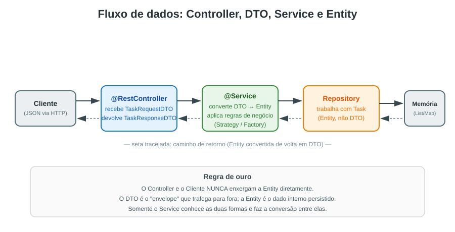
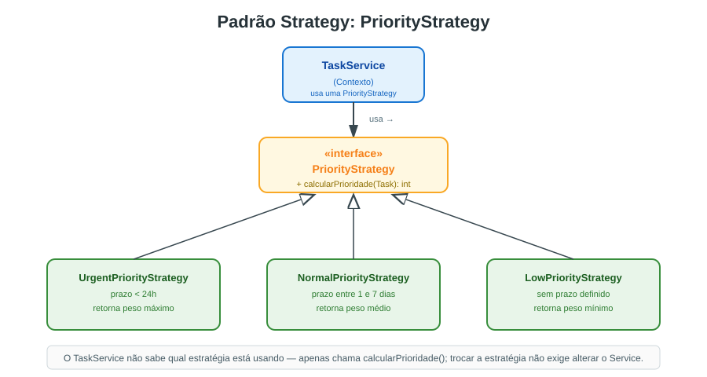
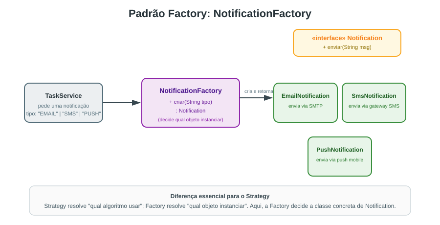

<!-- _class: lead -->

# Desenvolvimento de Sistemas Corporativos

## Semana 4 — A camada de negócio: `@Service`, DTOs e Padrões de Projeto (Strategy e Factory)

Curso Superior de Tecnologia em Sistemas para Internet
Java + Spring Boot 4

---

## Revisão rápida — Semana 3

Na semana passada construímos a **API de Tarefas (Task API)** com armazenamento em memória, e vimos o fluxo:

```
Controller  →  Service  →  Repository  →  (memória)
```

Cada camada registrava logs no console para deixarmos visível **quem chama quem**.

Hoje avançamos duas questões que ficaram em aberto:

- O que exatamente deve morar dentro do `@Service`?
- Por que não devolvemos a *Entity* diretamente para quem consome a API?

---

## Objetivos da aula de hoje

Ao final destes quatro tempos, o estudante deve ser capaz de:

1. Explicar a responsabilidade da camada de serviço (`@Service`) em uma aplicação corporativa;
2. Projetar e implementar **DTOs** usando *Java Records*;
3. Reconhecer quando aplicar os padrões de projeto **Strategy** e **Factory**;
4. Refatorar a Task API da Semana 3 introduzindo essas três peças.

---

## Agenda dos quatro tempos

| Tempo | Foco |
|---|---|
| 1ª aula (quarta) | Camada `@Service`: responsabilidade e boas práticas |
| 2ª aula (quarta) | DTOs com Java Records + atividade em pares |
| 3ª aula (sexta) | Padrão Strategy aplicado à priorização de tarefas |
| 4ª aula (sexta) | Padrão Factory aplicado à criação de notificações |

---

<!-- _class: lead -->

# Parte 1
## A camada `@Service`

---

## O que é a camada de serviço?

No Spring Boot, uma classe anotada com `@Service` é onde vive a **lógica de negócio** — as regras que fazem sentido para o *negócio*, não para o banco de dados nem para o protocolo HTTP.

```java
@Service
public class TaskService {

    private final TaskRepository repository;

    public TaskService(TaskRepository repository) {
        this.repository = repository;
    }

    public Task concluir(Long id) {
        Task tarefa = repository.buscarPorId(id);
        tarefa.marcarComoConcluida();
        return repository.salvar(tarefa);
    }
}
```

---

## Analogia da vida real: o restaurante

Pense em um restaurante bem organizado:

- O **garçom** (Controller) anota o pedido do cliente e o entrega para a cozinha — ele não decide o ponto da carne nem calcula o tempo de forno;
- A **cozinha** (Service) aplica as **regras do negócio**: a receita, o ponto de cozimento, a ordem de preparo, eventuais substituições;
- A **despensa** (Repository) apenas guarda e fornece os ingredientes — ela não sabe cozinhar.

> Se o garçom começasse a decidir a receita, ou se a despensa decidisse o cardápio, o restaurante perderia a organização. O mesmo vale para uma API mal camadas.

---

## Por que não colocar tudo no Controller?

| Se a lógica fica no Controller... | Se a lógica fica no Service... |
|---|---|
| Fica acoplada ao protocolo HTTP | Independe de HTTP, WebSocket ou CLI |
| Difícil de testar sem subir o servidor | Testável isoladamente com JUnit/Mockito |
| Regra duplicada se houver 2 endpoints parecidos | Regra centralizada e reaproveitável |
| Viola o Princípio da Responsabilidade Única (SRP) | Cada classe tem um único motivo para mudar |

Esse princípio (SRP) é o "S" dos princípios **SOLID**, que retomaremos ao longo do semestre.

---

## Curiosidade: de onde vem essa separação em camadas?

A separação **Apresentação → Negócio → Dados** foi consolidada por **Martin Fowler** no livro *Patterns of Enterprise Application Architecture* (2002), obra que catalogou padrões usados em sistemas corporativos de grande porte muito antes de frameworks como o Spring existirem.

O Spring **não inventou** a camada de serviço — ele apenas oferece anotações (`@Service`, `@Component`) e injeção de dependência para implementá-la de forma padronizada e testável.

---

<!-- _class: lead -->

# Parte 2
## Data Transfer Objects (DTOs)

---

## O problema de expor a Entity diretamente

Imagine devolver a `Task` (Entity) direto na resposta da API:

```java
@Entity
public class Task {
    @Id @GeneratedValue
    private Long id;
    private String titulo;
    private String senhaDeAcessoInterna; // campo sensível!
    private LocalDateTime criadoEm;
    @ManyToOne
    private Usuario responsavel; // carrega o usuário inteiro junto!
}
```

Problemas: campos internos vazam para fora, relacionamentos JPA podem gerar erros de serialização, e qualquer mudança no banco **quebra o contrato da API**.

---

## Analogia da vida real: o controle de imigração

Ao viajar para outro país, você não entrega seu **prontuário de vida inteiro** ao agente de imigração — você entrega um **passaporte**, um documento **resumido e padronizado**, com apenas os dados relevantes para aquele contexto (nome, nacionalidade, validade).

- O **passaporte** é o seu DTO;
- Os dados completos (endereço, histórico médico, conta bancária) continuam existindo — apenas não trafegam por ali;
- Se o formato interno do seu RG mudar, o passaporte pode continuar igual.

Um **DTO** funciona exatamente assim: um "documento de viagem" dos dados, moldado para uma finalidade específica.

---

## DTO com Java Records — por que records?

Desde o Java 16, *records* são o formato ideal para DTOs: imutáveis, curtos e sem "boilerplate" de getters/setters.

```java
// DTO de entrada (o que o cliente envia)
public record TaskRequestDTO(
        String titulo,
        String descricao,
        LocalDate prazo
) {}

// DTO de saída (o que a API devolve)
public record TaskResponseDTO(
        Long id,
        String titulo,
        boolean concluida,
        String prioridade
) {}
```

Um `record` já gera automaticamente construtor, `equals()`, `hashCode()` e `toString()` — menos código, menos chance de erro.

---

## Convertendo entre DTO e Entity

A conversão acontece **dentro do Service** — nem o Controller, nem o Repository devem fazer isso:

```java
@Service
public class TaskService {

    public TaskResponseDTO criar(TaskRequestDTO dto) {
        Task tarefa = new Task(dto.titulo(), dto.descricao(), dto.prazo());
        Task salva = repository.salvar(tarefa);
        return new TaskResponseDTO(
                salva.getId(), salva.getTitulo(),
                salva.isConcluida(), salva.getPrioridade()
        );
    }
}
```

> Curiosidade: em projetos maiores, essa conversão manual é substituída por bibliotecas como o **MapStruct**, que geram o código de mapeamento em tempo de compilação.

---

## O fluxo completo



---

## O fluxo completo

O Controller nunca enxerga a `Task` (Entity).
O Repository nunca enxerga o `TaskRequestDTO`.

Apenas o `@Service` conhece as duas formas e faz a "tradução" entre elas — como um intérprete em uma reunião internacional.

---

## Comparativo: Entity × DTO

| Aspecto | Entity | DTO |
|---|---|---|
| Anotação | `@Entity` (JPA) | `record` simples |
| Onde vive | Camada de dados | Camada de apresentação/API |
| Pode ter relacionamentos JPA | Sim (`@OneToMany` etc.) | Não — apenas campos simples |
| Exposta ao cliente externo | Nunca | Sempre que necessário |
| Estabilidade | Muda com o banco | Muda com o contrato da API |

---

<!-- _class: lead -->

# Atividade em pares (15 minutos)

## Identificando vazamentos de Entity

---

## Atividade 1 — Em pares

**Contexto:** seguem três trechos de resposta JSON de uma API mal projetada, que devolve a Entity diretamente.

**Trecho 1**
```json
{ "id": 3, "titulo": "Revisar contrato", "criadoPor": { "id": 12, "senhaHash": "8f14e45..." } }
```

**Trecho 2**
```json
{ "id": 7, "titulo": "Migrar servidor", "auditoria": { "ultimaModificacaoInterna": "2026-09-09T02:11:00" } }
```

**Trecho 3**
```json
{ "id": 9, "titulo": "Enviar relatório", "prazo": null, "versaoOtimista": 4 }
```

--- 

**Tarefa:**

1. Para cada trecho, aponte **qual informação não deveria estar ali**;
2. Proponha os campos de um `TaskResponseDTO` (record) que resolveria o problema;
3. Um integrante da dupla implementa o `record`; o outro escreve, em uma frase, por que aquele campo foi removido.

Ao final, dois pares compartilham sua proposta de DTO com a turma (5 minutos).

---

<!-- _class: lead -->

# Parte 3
## Padrão de Projeto: Strategy

---

## Por que "padrões de projeto"?

Os **padrões de projeto (Design Patterns)** são soluções **reutilizáveis** para problemas recorrentes de design de software, catalogadas pela primeira vez em 1994 pelo grupo conhecido como **Gang of Four** (Gamma, Helm, Johnson, Vlissides).

Eles não são bibliotecas nem frameworks — são **formas comprovadas de organizar classes e objetos**, com nome próprio, para que times inteiros se entendam ao dizer "aplique um Strategy aqui".

Hoje veremos dois: **Strategy** e **Factory**.

---

## O problema: priorizar tarefas

Nossa Task API precisa calcular a prioridade de uma tarefa, mas a regra pode variar:

```java
public int calcularPrioridade(Task tarefa) {
    if (tarefa.getPrazo().isBefore(LocalDate.now().plusDays(1))) {
        return 10; // urgente
    } else if (tarefa.getPrazo().isBefore(LocalDate.now().plusDays(7))) {
        return 5;  // normal
    }
    return 1; // baixa
}
```

Se amanhã surgir uma quarta regra de prioridade (ex.: "tarefas do cliente VIP"), esse método vira um emaranhado de `if/else`. É aqui que entra o **Strategy**.

---

## Analogia da vida real: o aplicativo de rotas

Pense em um aplicativo de mapas: você pede uma rota e pode escolher entre **rota mais rápida**, **rota mais econômica** ou **rota mais cênica**.

- O aplicativo (o **Contexto**) continua sendo o mesmo;
- Ele apenas **troca o algoritmo** usado para calcular a rota;
- Cada algoritmo (cada "estratégia") sabe fazer seu próprio cálculo, sem que o aplicativo precise conhecer os detalhes internos de cada um.

O padrão **Strategy** faz exatamente isso com **regras de negócio intercambiáveis**.

---

## Estrutura do padrão

```java
public interface PriorityStrategy {
    int calcularPrioridade(Task tarefa);
}
```

Uma interface simples define **o que** deve ser feito; cada implementação decide **como**.

---



---

## As três estratégias de prioridade

```java
public class UrgentPriorityStrategy implements PriorityStrategy {
    public int calcularPrioridade(Task tarefa) {
        return 10;
    }
}

public class NormalPriorityStrategy implements PriorityStrategy {
    public int calcularPrioridade(Task tarefa) {
        return 5;
    }
}

public class LowPriorityStrategy implements PriorityStrategy {
    public int calcularPrioridade(Task tarefa) {
        return 1;
    }
}
```

O `TaskService` escolhe **qual estratégia usar** de acordo com o prazo da tarefa, mas delega o cálculo em si.

---

## Curiosidade: você já usa Strategy sem saber

O próprio **JDK** usa o padrão Strategy no dia a dia:

```java
List<Task> tarefas = new ArrayList<>();
tarefas.sort(Comparator.comparing(Task::getPrazo));
tarefas.sort(Comparator.comparing(Task::getTitulo));
```

Cada `Comparator` passado é uma **estratégia diferente de ordenação**. O método `sort()` (o Contexto) não muda — apenas o algoritmo injetado muda.

---

<!-- _class: lead -->

# Parte 4
## Padrão de Projeto: Factory

---

## O problema: criar notificações

Ao concluir uma tarefa, o sistema precisa notificar o responsável — por e-mail, SMS ou push, dependendo da preferência do usuário.

```java
Notification notificacao;
if (tipo.equals("EMAIL")) {
    notificacao = new EmailNotification();
} else if (tipo.equals("SMS")) {
    notificacao = new SmsNotification();
} else {
    notificacao = new PushNotification();
}
notificacao.enviar(mensagem);
```

Esse `if/else` de criação de objetos, espalhado pelo código, é exatamente o problema que o **Factory** resolve.

---

## Analogia da vida real: a linha de produção

Em uma fábrica de veículos, o cliente não monta o carro peça por peça — ele informa **o modelo desejado** a um consultor, e a fábrica (a "Factory") sabe qual linha de montagem acionar para entregar o veículo pronto.

- Quem pede não precisa saber os detalhes de fabricação de cada modelo;
- A fábrica concentra a **decisão de qual produto concreto instanciar**;
- Se surgir um novo modelo, a fábrica se adapta — quem pede continua pedindo do mesmo jeito.

---

## A `NotificationFactory`

```java
public class NotificationFactory {

    public Notification criar(String tipo) {
        return switch (tipo) {
            case "EMAIL" -> new EmailNotification();
            case "SMS"   -> new SmsNotification();
            case "PUSH"  -> new PushNotification();
            default -> throw new IllegalArgumentException(
                    "Tipo de notificação desconhecido: " + tipo);
        };
    }
}
```

O `switch` com *arrow syntax* (Java 14+) deixa a fábrica curta e legível.

---



---

## Strategy × Factory: qual a diferença?

| | Strategy | Factory |
|---|---|---|
| Pergunta que resolve | "Qual **algoritmo** usar?" | "Qual **objeto** criar?" |
| O que varia | O comportamento (método) | A classe concreta instanciada |
| Exemplo de hoje | Cálculo de prioridade | Criação de notificação |
| Onde normalmente é chamado | Dentro do Service, a cada execução | No momento da criação do objeto |

Os dois padrões **podem conviver na mesma classe** — como veremos no `TaskService` completo do laboratório de hoje.

---

## Curiosidade: Factory Method × Abstract Factory

O GoF descreve duas variações do padrão:

- **Factory Method**: um único método de criação (o nosso `criar(tipo)` de hoje);
- **Abstract Factory**: uma **interface com várias fábricas relacionadas**, cada uma responsável por criar um produto diferente da mesma "família".

Por ora trabalhamos com o Factory Method — o mais simples e o mais comum em aplicações corporativas de médio porte.

---

## Abstract Factory — um exemplo concreto

Imagine que cada canal de notificação também precisa de um **formatador de mensagem** próprio. Uma `NotificationChannelFactory` (Abstract Factory) cria os dois produtos da mesma família de uma só vez:

```java
public interface NotificationChannelFactory {
    Notification criarNotificacao();
    MessageFormatter criarFormatador();
}

public class EmailChannelFactory implements NotificationChannelFactory {
    public Notification criarNotificacao() { return new EmailNotification(); }
    public MessageFormatter criarFormatador() { return new HtmlMessageFormatter(); }
}

public class SmsChannelFactory implements NotificationChannelFactory {
    public Notification criarNotificacao() { return new SmsNotification(); }
    public MessageFormatter criarFormatador() { return new PlainTextMessageFormatter(); }
}
```

Quem consome a fábrica recebe **sempre uma combinação coerente** (e-mail nunca vem com formatador de SMS, por exemplo) — essa é a garantia que o Abstract Factory oferece e que o Factory Method, sozinho, não tem.

---

## Síntese da aula

- `@Service` concentra a **lógica de negócio**, separada de HTTP e de persistência;
- **DTOs** (via *records*) protegem a Entity e estabilizam o contrato da API — como um passaporte resume seus dados pessoais;
- **Strategy** troca **algoritmos** de forma intercambiável — como as rotas de um aplicativo de mapas;
- **Factory** centraliza a **criação de objetos** — como uma linha de produção que entrega o modelo certo sob demanda.

Essas três peças, juntas, tornam o `TaskService` organizado, testável e pronto para crescer.

---

<!-- _class: lead -->

# Para o laboratório de hoje

Vamos refatorar a Task API da Semana 3:

- Introduzir `TaskRequestDTO` e `TaskResponseDTO`;
- Implementar as três `PriorityStrategy`;
- Implementar a `NotificationFactory`;
- Manter, por enquanto, o armazenamento em memória — a persistência em banco de dados chega na Semana 5.

**Abram o guia de laboratório da Semana 4.**

---

<!-- _class: lead -->

# Dúvidas?

Próxima aula: **Segurança e integridade dos dados** — validação com Bean Validation e boas práticas contra injeção de dados.
