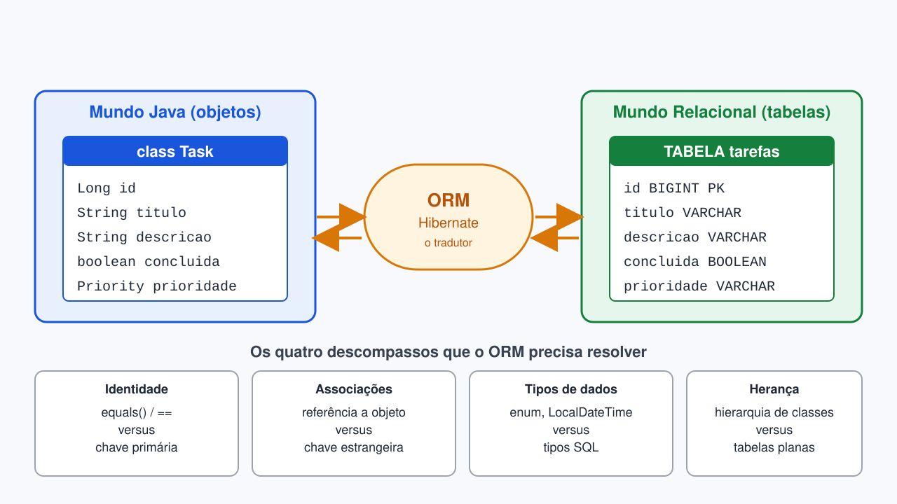
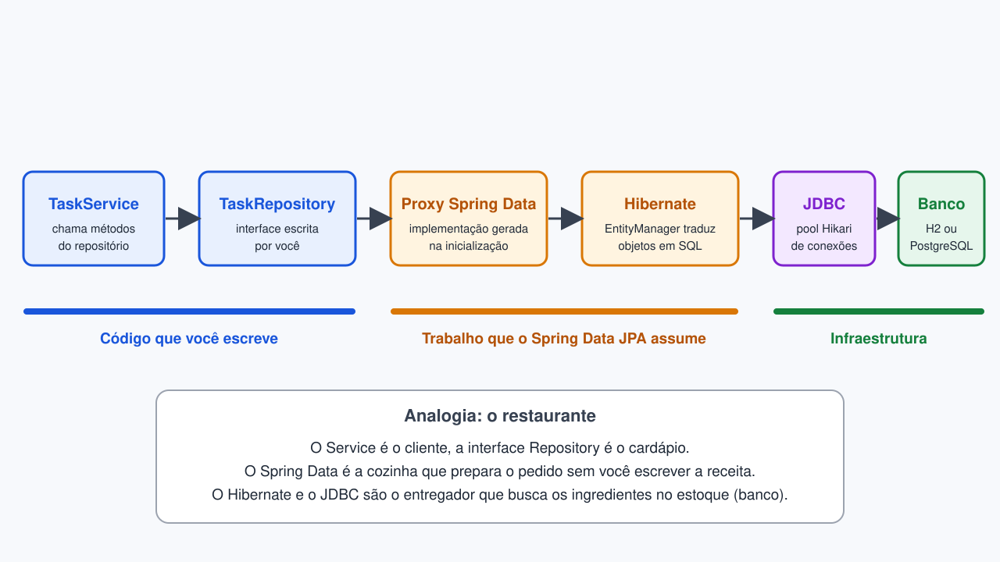
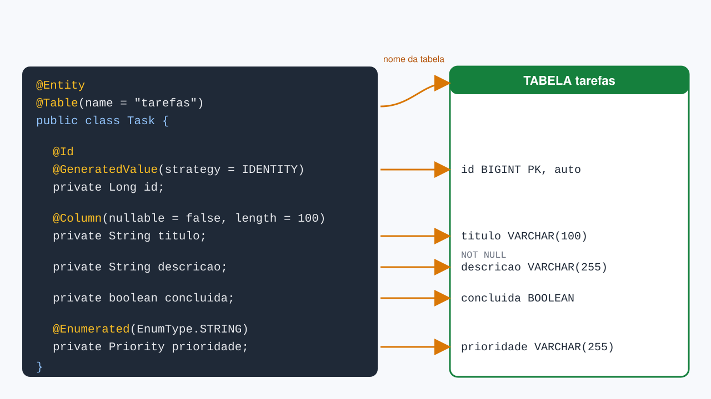
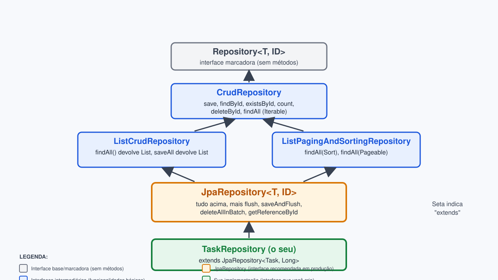

<!-- _class: lead -->

# Semana 5
## Spring Data JPA: o básico da persistência

Desenvolvimento de Sistemas Corporativos
Curso Superior de Tecnologia em Sistemas para Internet

---

## Onde estamos na jornada

| Semana | Conquista desbloqueada |
|---|---|
| 1 | Visão geral dos sistemas de informação corporativos |
| 2 | Servidor embarcado e JAR executável |
| 3 | Arquitetura em camadas (Controller, Service, Repository) |
| 4 | Service, DTOs, Strategy e Factory |
| **5** | **Persistência real com Spring Data JPA** |

**Problema atual:** ao reiniciar a aplicação, todas as tarefas desaparecem.

---

## Missão da semana

Levar a Task API da memória para um banco de dados relacional, **sem reescrever a lógica de negócio**.

Ao final, você será capaz de:

- explicar o que é ORM e por que ele existe;
- mapear uma classe Java para uma tabela com `@Entity`;
- criar um repositório com `JpaRepository` sem escrever SQL;
- configurar o H2 e observar o SQL gerado;
- migrar o repositório em memória para o repositório JPA.

---

## O problema da memória volátil

Nas semanas anteriores, os dados viviam em uma `List<Task>` dentro do repositório.

- Reiniciou a aplicação: dados perdidos.
- Dois servidores rodando: cada um com uma lista diferente.
- Sem consultas, ordenação ou integridade.

**Analogia:** guardar as anotações de uma empresa na lousa da sala de reunião. Serve durante a reunião; ao apagar a lousa, tudo se perde. O banco de dados é o **arquivo físico** da empresa.

---

## Caminho clássico: JDBC puro

```java
String sql = "SELECT id, titulo, concluida FROM tarefas WHERE id = ?";
try (Connection con = dataSource.getConnection();
     PreparedStatement ps = con.prepareStatement(sql)) {
    ps.setLong(1, id);
    try (ResultSet rs = ps.executeQuery()) {
        if (rs.next()) {
            Task t = new Task();
            t.setId(rs.getLong("id"));
            t.setTitulo(rs.getString("titulo"));
            t.setConcluida(rs.getBoolean("concluida"));
            return Optional.of(t);
        }
    }
}
return Optional.empty();
```

Vinte linhas para **buscar um registro**. Multiplique por cada entidade e cada operação.

---

<!-- _class: img -->



# O descompasso entre objetos e tabelas

---

## Curiosidade: o "problema de impedância"

O termo vem da **engenharia elétrica**: quando dois circuitos com impedâncias diferentes são conectados, parte do sinal se perde.

Na computação, o mesmo ocorre entre:

- o **modelo orientado a objetos** (classes, herança, referências);
- o **modelo relacional** (tabelas, linhas, chaves).

**Analogia:** um intérprete em uma reunião internacional. Ninguém precisa aprender o idioma do outro, mas alguém precisa traduzir. O ORM é esse intérprete.

---

## Os desafios da impedância: detalhado

### 1. Paradigmas fundamentalmente diferentes

**Objetos (Java):** identidade (referências), herança de classes, relacionamentos bidirecionais, métodos.

**Tabelas (Banco):** valor (chaves), estrutura plana, chaves estrangeiras, apenas dados.

### 2. Granularidade diferente

Um objeto complexo em Java:
```java
public class Pedido {
    private Cliente cliente;        // Objeto completo
    private List<ItemPedido> itens; // Coleção
    private Endereco endereco;      // Objeto aninhado
}
```

Vira **múltiplas tabelas**: `pedidos`, `clientes`, `itens_pedido`, `enderecos`. Uma operação simples (`pedido.getCliente()`) gera várias `JOINs`.

### 3. Herança: problema crítico

Java permite: `class Carro extends Veiculo`. SQL não.

| Estratégia | Tabelas | Custo |
|---|---|---|
| **Single Table** | 1 tabela com coluna `tipo` | Colunas nulas |
| **Joined** | Múltiplas com FK | JOINs em toda consulta |
| **Table per class** | Múltiplas sem FK | Consulta polimórfica complexa |

### 4. Identidade vs. Igualdade

Dois `new Task("Estudar")` são iguais em Java. No banco, são registros diferentes (IDs diferentes). O Hibernate rastreia qual objeto = qual linha.

### 5. Relacionamentos bidirecionais

```java
public class Autor { private List<Livro> livros; }
public class Livro { private Autor autor; }
```

Ambos apontam um para o outro em Java. No banco: apenas uma direção possível (FK em `livros`). Sincronizar sem bugs é um clássico desafio.

**O ORM resolve:** converte objetos ↔ SQL, gerencia identidade, detecta mudanças e carrega sob demanda. Sem ele, você faria tudo manualmente com JDBC.

---

## O que é ORM

**Object-Relational Mapping**: técnica que converte automaticamente objetos Java em linhas de tabelas, e vice-versa.

| Camada | Papel | Quem é |
|---|---|---|
| Especificação | Define as regras do mapeamento | **JPA** (Jakarta Persistence) |
| Implementação | Executa o mapeamento e gera SQL | **Hibernate** |
| Abstração | Elimina o código repetitivo dos repositórios | **Spring Data JPA** |

**Analogia:** JPA é o código de trânsito, Hibernate é o motorista que o aplica e Spring Data JPA é o aplicativo de navegação que decide a rota por você.

---

<!-- _class: img -->



# O caminho de uma chamada até o banco

---

## Comparativo: em memória versus JPA

| Aspecto | Repositório em memória | Spring Data JPA |
|---|---|---|
| Armazenamento | `List` na JVM | Tabela no banco |
| Persistência após reiniciar | Não | Sim |
| Geração de `id` | Contador manual | `@GeneratedValue` |
| Implementação do repositório | Você escreve | Spring gera |
| Consultas | Laços e filtros | Métodos derivados e SQL |
| Concorrência | Precisa de cuidado manual | Delegada ao banco |

A camada **Service não muda**: esse é o benefício da arquitetura em camadas da Semana 3.

---

## Passo 1: dependências

Gere o projeto em **start.spring.io** (ou adicione ao `pom.xml`):

```xml
<dependency>
    <groupId>org.springframework.boot</groupId>
    <artifactId>spring-boot-starter-data-jpa</artifactId>
</dependency>
<dependency>
    <groupId>com.h2database</groupId>
    <artifactId>h2</artifactId>
    <scope>runtime</scope>
</dependency>
```

- O starter traz Spring Data JPA, Hibernate e o pool de conexões HikariCP.
- O H2 é um banco Java embarcado, ideal para desenvolvimento: **não exige instalação**.
- Em produção, troca-se apenas o driver (PostgreSQL) e a URL.

---

## Passo 2: configuração no `application.properties`

```properties
spring.datasource.url=jdbc:h2:mem:tarefasdb
spring.datasource.username=sa
spring.datasource.password=

spring.jpa.hibernate.ddl-auto=update
spring.jpa.show-sql=true
spring.jpa.properties.hibernate.format_sql=true
```

| Propriedade | Efeito |
|---|---|
| `ddl-auto=update` | Cria e ajusta as tabelas a partir das entidades |
| `show-sql=true` | Exibe no console cada SQL executado |
| `format_sql=true` | Quebra o SQL em linhas legíveis |

**Atenção:** `ddl-auto=update` é para estudo. Em produção, o esquema é controlado por migrações versionadas.

---

## Atividade 1: reconhecendo o terreno (5 minutos)

Em duplas, respondam:

1. Cite duas consequências práticas de manter tarefas apenas em uma `List`.
2. Qual é a diferença entre **JPA**, **Hibernate** e **Spring Data JPA**? Expliquem com uma analogia própria.
3. Por que a camada `Service` não precisa ser alterada ao trocar o tipo de armazenamento?

**Desafio bônus:** o que aconteceria com os dados se usássemos `jdbc:h2:mem:` e reiniciássemos a aplicação? E com `jdbc:h2:file:./data/tarefasdb`?

---

<!-- _class: img -->



# Mapeando a classe Task para a tabela tarefas

---

## Anotações essenciais da entidade

| Anotação | Função |
|---|---|
| `@Entity` | Declara que a classe é mapeada para uma tabela |
| `@Table(name = "...")` | Define o nome da tabela (opcional) |
| `@Id` | Marca a chave primária |
| `@GeneratedValue` | O banco gera o valor da chave |
| `@Column` | Ajusta nome, tamanho e obrigatoriedade |
| `@Enumerated(EnumType.STRING)` | Grava o nome do enum, não a posição |

**Regra de ouro:** a entidade precisa de um **construtor sem argumentos**, pois o Hibernate cria os objetos por conta própria.

---

## Exemplo completo com Lombok

```java
@Entity
@Table(name = "tarefas")
@Getter @Setter
@NoArgsConstructor @AllArgsConstructor
public class Task {

    @Id
    @GeneratedValue(strategy = GenerationType.IDENTITY)
    private Long id;

    @Column(nullable = false, length = 100)
    private String titulo;

    private String descricao;

    private boolean concluida;

    @Enumerated(EnumType.STRING)
    private Priority prioridade;
}
```

Os imports vêm do pacote **`jakarta.persistence`** (Jakarta EE 11), e não de `javax`.

---

## Armadilhas de quem está começando

- **`@Data` em entidades:** gera `equals`, `hashCode` e `toString` sobre todos os campos, o que causa problemas quando houver relacionamentos. Prefira `@Getter` e `@Setter`.
- **`@Enumerated` sem `STRING`:** o padrão grava a posição (0, 1, 2). Se alguém reordenar o enum, todos os dados antigos passam a significar outra coisa.
- **Tipos primitivos no `id`:** use `Long`, pois um objeto novo precisa de `id` nulo para indicar que ainda não foi salvo.
- **Esquecer o construtor vazio:** a aplicação falha na inicialização.

**Analogia:** o enum gravado por posição é como numerar as gavetas de um arquivo e depois trocar a ordem das gavetas sem avisar ninguém.

---

## Estratégias de geração de `id`

| Estratégia | Como funciona | Quando usar |
|---|---|---|
| `IDENTITY` | Coluna auto incremento do banco | H2, PostgreSQL, MySQL (uso mais comum) |
| `SEQUENCE` | Sequência independente do banco | PostgreSQL e Oracle, com muitas inserções |
| `UUID` | Identificador universal gerado na aplicação | Sistemas distribuídos |
| `AUTO` | O provedor escolhe | Quando o portátil importa mais que o controle |

Na disciplina, usaremos `IDENTITY` para manter o foco.

---

## Atividade 2: monte a entidade (10 minutos)

Sem consultar os slides anteriores, em duplas:

1. Escrevam a classe `Task` como entidade, com `id`, `titulo`, `descricao`, `concluida` e `prioridade`.
2. Definam `titulo` como obrigatório com no máximo 100 caracteres.
3. Escolham corretamente como gravar o enum `Priority`.
4. Iniciem a aplicação e localizem no console o comando `create table` gerado pelo Hibernate.

**Critério de sucesso:** o SQL de criação da tabela aparece no console sem erros.

---

<!-- _class: img -->



# A hierarquia de repositórios do Spring Data

---

## O repositório em uma única linha

```java
public interface TaskRepository extends JpaRepository<Task, Long> {
}
```

- `Task`: a entidade que este repositório gerencia.
- `Long`: o tipo da chave primária.
- **Nenhuma implementação.** O Spring cria um proxy em tempo de execução e o registra como bean.

Basta injetar no `Service`:

```java
@Service
@RequiredArgsConstructor
public class TaskService {
    private final TaskRepository repository;
}
```

---

## Curiosidade: por que uma interface basta

Ao iniciar a aplicação, o Spring Data:

1. varre o projeto e encontra interfaces que estendem `Repository`;
2. gera, com **proxies dinâmicos**, uma classe que implementa essa interface;
3. liga cada método ao Hibernate;
4. registra o resultado como um bean, pronto para `@Autowired` ou injeção por construtor.

**Analogia:** você entrega ao arquiteto apenas a planta com o nome dos cômodos, e a construtora entrega a casa pronta. Quem já escreveu um repositório manual sabe quanto trabalho isso poupa.

---

## Métodos prontos que você recebe de graça

| Método | Equivalente em SQL |
|---|---|
| `save(task)` | `INSERT` (id nulo) ou `UPDATE` (id existente) |
| `findById(id)` | `SELECT ... WHERE id = ?` |
| `findAll()` | `SELECT ... FROM tarefas` |
| `existsById(id)` | `SELECT count(...) WHERE id = ?` |
| `count()` | `SELECT count(*)` |
| `deleteById(id)` | `DELETE ... WHERE id = ?` |

Observe: `findById` devolve **`Optional<Task>`**, forçando o tratamento do caso em que o registro não existe.

---

## Migrando o Service

**Antes** (memória, Semana 3):

```java
public Task buscar(Long id) {
    return repository.findById(id)   // método escrito por nós
            .orElseThrow(() -> new NoSuchElementException("Tarefa não encontrada"));
}
```

**Depois** (JPA): o código é **idêntico**, pois o contrato do repositório foi mantido.

```java
public Task criar(TaskRequest dto) {
    Task task = new Task();
    task.setTitulo(dto.titulo());
    task.setDescricao(dto.descricao());
    return repository.save(task);   // devolve a entidade com id preenchido
}
```

O `id` é gerado pelo banco e devolvido dentro do objeto retornado por `save`.

---

## Tratando Optional: quando o registro não existe

`findById` devolve `Optional<Task>`. Existem várias formas de lidar:

### 1. **orElseThrow()** — Lançar exceção ✅ Recomendado

```java
public Task buscar(Long id) {
    return repository.findById(id)
            .orElseThrow(() -> new NoSuchElementException("Tarefa não encontrada"));
}
```

### 2. **orElse()** — Retornar valor padrão

```java
return repository.findById(id).orElse(new Task());
```

### 3. **orElseGet()** — Computar padrão sob demanda

```java
return repository.findById(id)
        .orElseGet(() -> criarTarefaPadrão());
```

### 4. **ifPresent()** — Operação opcional (sem retorno)

```java
repository.findById(id)
        .ifPresent(task -> repository.delete(task));
```

### 5. **No Controller** — Retornar 404 explícito

```java
@GetMapping("/{id}")
public ResponseEntity<TaskResponse> obter(@PathVariable Long id) {
    return repository.findById(id)
            .map(task -> ResponseEntity.ok(new TaskResponse(task)))
            .orElse(ResponseEntity.notFound().build());
}
```

**Regra de ouro:** use `orElseThrow()` no Service para manter a lógica clara. O Spring converte a exceção em HTTP 404 automaticamente.

---

## Lendo o SQL gerado

Ao chamar `POST /tasks`, o console exibe:

```sql
Hibernate:
    insert
    into
        tarefas
        (concluida, descricao, prioridade, titulo, id)
    values
        (?, ?, ?, ?, default)
```

E ao chamar `GET /tasks/1`:

```sql
Hibernate:
    select
        t1_0.id, t1_0.concluida, t1_0.descricao,
        t1_0.prioridade, t1_0.titulo
    from
        tarefas t1_0
    where
        t1_0.id=?
```

**Habilidade profissional:** ler o SQL gerado é o primeiro passo para diagnosticar lentidão.

---

## Curiosidade: o console do H2

O H2 oferece uma interface web para consultar o banco durante o desenvolvimento.

```properties
spring.h2.console.enabled=true
spring.h2.console.path=/h2-console
```

- Acesse `http://localhost:8080/h2-console`.
- Informe a URL `jdbc:h2:mem:tarefasdb` e o usuário `sa`.
- Execute `SELECT * FROM tarefas` e compare com o que sua API devolve.

**Analogia:** é a janela de vidro do arquivo, que permite conferir o que realmente foi guardado.

---

## Atividade 3: missão de migração (25 minutos)

Em duplas, no projeto da Task API:

1. Substitua o repositório em memória por `TaskRepository extends JpaRepository<Task, Long>`.
2. Ajuste o `Service` para usar `save`, `findById`, `findAll` e `deleteById`.
3. Teste no Postman ou Insomnia: crie três tarefas, liste, atualize uma e exclua outra.
4. **Reinicie a aplicação com o banco em modo arquivo** (`jdbc:h2:file:./data/tarefasdb`) e verifique se as tarefas continuam lá.

**Entrega:** captura de tela do console mostrando o SQL de `insert` e `select`, e do H2 Console com os dados.

O passo a passo completo está no **guia de laboratório da Semana 5**.

---

## Um vislumbre do que vem a seguir

O Spring Data também interpreta o **nome** do método e gera a consulta:

```java
public interface TaskRepository extends JpaRepository<Task, Long> {
    List<Task> findByConcluida(boolean concluida);
    List<Task> findByPrioridade(Priority prioridade);
    List<Task> findByTituloContainingIgnoreCase(String trecho);
}
```

Na próxima semana aprofundaremos:

- consultas derivadas e `@Query`;
- relacionamentos entre entidades;
- boas práticas de modelagem.

---

## Recapitulação

- **ORM** traduz objetos em tabelas e resolve o problema de impedância.
- **JPA** é a especificação, **Hibernate** a implementação e **Spring Data JPA** a camada que elimina o código repetitivo.
- `@Entity`, `@Id`, `@GeneratedValue` e `@Column` mapeiam a classe.
- `JpaRepository<Task, Long>` entrega o CRUD completo **sem implementação**.
- `show-sql` e o H2 Console permitem **enxergar** o que acontece.
- Em uma arquitetura em camadas, trocar o armazenamento **não altera o Service**.

---

## Para consolidar em casa

1. Conclua a Atividade 3 e o desafio do guia de laboratório.
2. Leia o guia "Accessing Data with JPA" em spring.io/guides.
3. Prepare uma dúvida sobre o SQL gerado para discutirmos na próxima aula.

<!-- _class: lead -->

**Boa jornada: seus dados agora sobrevivem à reinicialização.**
