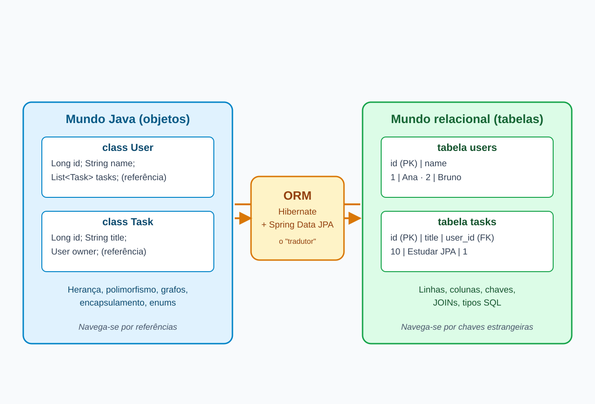
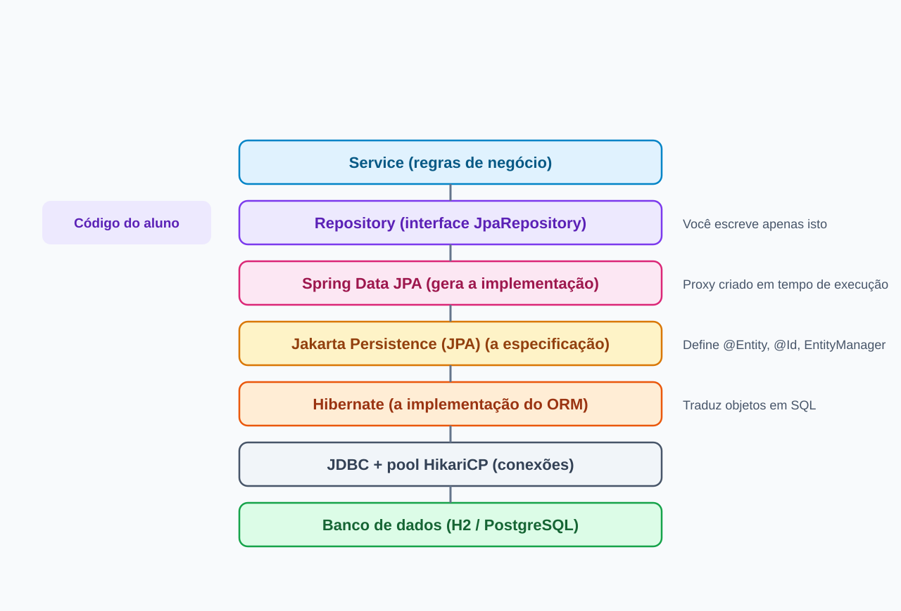
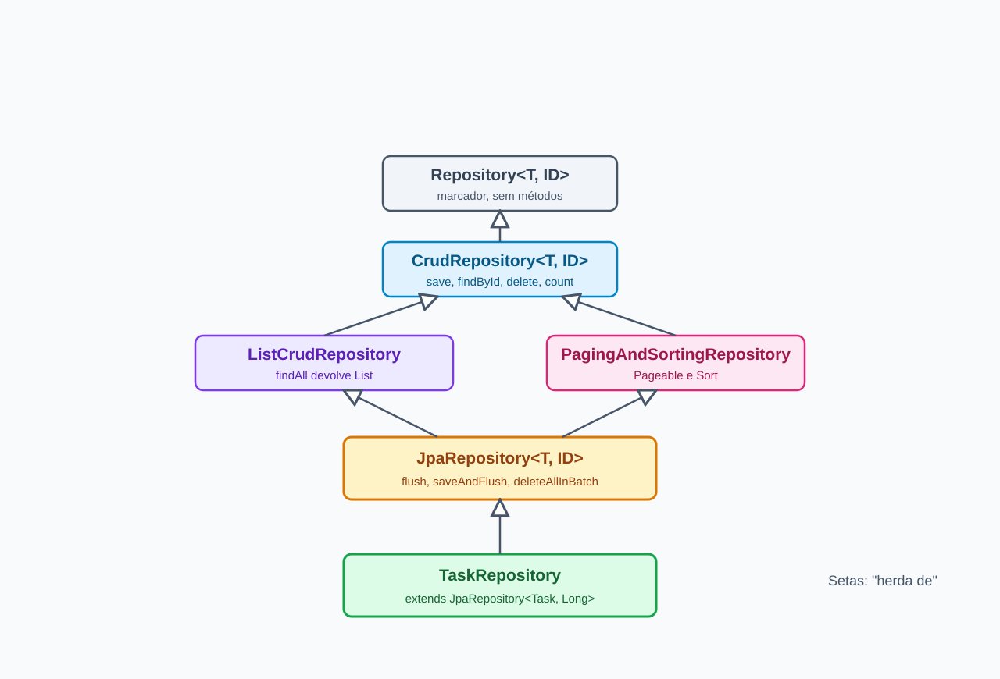
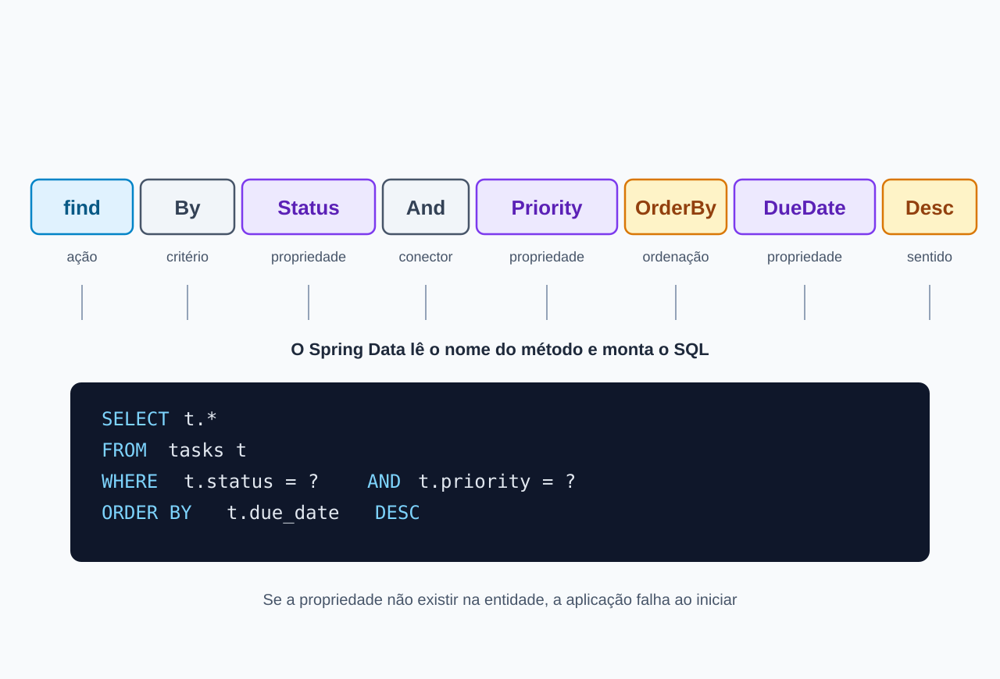
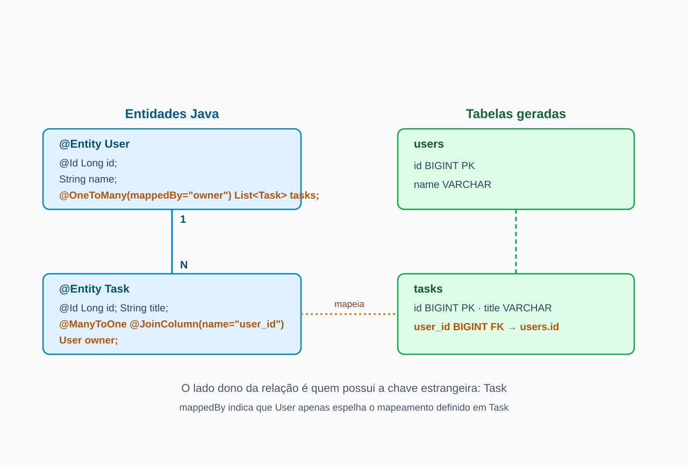

<!-- _class: lead -->
<!-- _paginate: false -->

# Persistência na prática
## Spring Data JPA e Hibernate

Semana 6 | Unidade 3.4 (continuação)
Entidades, repositórios, consultas derivadas, `@Query` e relacionamentos

---

# Roteiro da semana

1. Por que objetos e tabelas "não conversam" naturalmente
2. JPA, Hibernate e Spring Data: quem é quem
3. Entidades: `@Entity`, `@Id`, `@Column`, `@Enumerated`
4. Repositórios com `JpaRepository`
5. Consultas derivadas e `@Query`
6. Relacionamento **User 1:N Task**
7. Missão prática: a Central de Tarefas ganha memória permanente

**Meta:** substituir a lista em memória por um banco de dados real, sem perder a estrutura em camadas construída até aqui.

---

# De onde viemos

| Semana | O que construímos | Onde os dados viviam |
|---|---|---|
| 3 | Controller, Service, Repository | `List` em memória |
| 4 | DTOs (`record`), Strategy, Factory | `List` em memória |
| 5 | Avaliação prática e introdução ao ORM | `List` em memória |
| **6** | **Entidades e repositórios JPA** | **Banco de dados** |

**Problema atual:** ao reiniciar a aplicação, todas as tarefas desaparecem.

Analogia: uma lista em memória é um quadro branco. Útil para ensaiar, mas alguém apaga ao fim do expediente. O banco é o arquivo da empresa.

---

# A analogia do arquivista

Imagine um escritório que pensa em **pastas de projeto** (objetos), enquanto o arquivo da empresa só aceita **fichas padronizadas** (linhas de tabela).

- Alguém precisa desmontar a pasta em fichas para guardar.
- Alguém precisa remontar a pasta a partir das fichas ao consultar.
- Fazer isso à mão, todos os dias, para todos os documentos, é lento e sujeito a erro.

O **ORM** é o arquivista dedicado. Você entrega o objeto, ele decide as fichas, os campos e o SQL.

---

<!-- _class: imagem -->

# O problema de impedância objeto-relacional



---

<!-- _class: dense -->

# Onde os dois mundos divergem

| Aspecto | Orientação a objetos | Modelo relacional |
|---|---|---|
| Unidade básica | Objeto (estado + comportamento) | Linha de tabela |
| Identidade | Referência em memória (`==`) | Chave primária |
| Associação | Referência direta entre objetos | Chave estrangeira e `JOIN` |
| Herança | Nativa da linguagem | Não existe; exige estratégia de mapeamento |
| Navegação | `usuario.getTarefas()` | Consulta SQL |
| Tipos | `enum`, `LocalDate`, coleções | Tipos SQL escalares |

Sem ORM, cada linha dessa tabela vira código manual: `ResultSet`, `PreparedStatement`, conversões e laços de montagem de objetos.

---

# Curiosidade: de onde vem o nome "impedância"

- O termo foi emprestado da **engenharia elétrica**: quando dois circuitos com impedâncias diferentes são conectados, parte do sinal se perde na junção.
- Na computação, a expressão ganhou força a partir dos anos 1980, com as tentativas de acoplar linguagens orientadas a objetos a bancos relacionais.
- O **Hibernate** nasceu em 2001, criado por Gavin King, como resposta prática a esse atrito na comunidade Java.
- Suas ideias inspiraram a especificação **JPA** (2006), hoje mantida como **Jakarta Persistence**.

Curioso: o ORM não elimina a diferença entre os mundos. Ele a **administra** para você.

---

# JPA, Hibernate e Spring Data: quem é quem

Analogia da **tomada elétrica**:

| Elemento | Na analogia | No Java |
|---|---|---|
| **JPA** (Jakarta Persistence) | A norma da tomada (formato, voltagem) | Especificação: `@Entity`, `EntityManager` |
| **Hibernate** | O fabricante que cumpre a norma | Implementação padrão usada no Spring Boot |
| **Spring Data JPA** | O eletricista que instala tudo pronto | Gera repositórios a partir de interfaces |

Você programa contra a **norma**, e o Spring Boot 4 entrega o **fabricante** já configurado.

---

<!-- _class: imagem -->

# A pilha de persistência no Spring Boot 4



---

<!-- _class: code -->

# Entidade: o objeto que vira tabela

```java
import jakarta.persistence.*;
import java.time.LocalDate;

@Entity
@Table(name = "tasks")
public class Task {

    @Id
    @GeneratedValue(strategy = GenerationType.IDENTITY)
    private Long id;

    @Column(nullable = false, length = 120)
    private String title;

    @Enumerated(EnumType.STRING)
    private TaskStatus status = TaskStatus.PENDING;

    @Enumerated(EnumType.STRING)
    private Priority priority = Priority.MEDIUM;

    private LocalDate dueDate;

    protected Task() { }   // exigido pelo JPA
    // construtor de negócio, getters e setters
}
```

---

<!-- _class: dense -->

# Anotações essenciais

| Anotação | Função | Exemplo |
|---|---|---|
| `@Entity` | Declara que a classe é persistente | `@Entity class Task` |
| `@Table` | Define o nome da tabela | `@Table(name = "tasks")` |
| `@Id` | Marca a chave primária | `@Id Long id` |
| `@GeneratedValue` | Delega ao banco a geração do id | `strategy = IDENTITY` |
| `@Column` | Ajusta a coluna | `nullable = false, length = 120` |
| `@Enumerated` | Como gravar o `enum` | `EnumType.STRING` |
| `@Transient` | Campo que não vai ao banco | valores calculados |

Todas vêm do pacote **`jakarta.persistence`**, o padrão do Jakarta EE 11 adotado pelo Spring Boot 4. O antigo `javax.persistence` não é mais utilizado.

---

<!-- _class: dense -->

# Três armadilhas clássicas nas entidades

**1. `EnumType.ORDINAL` (o padrão) grava a posição do enum.**
Se alguém inserir um valor no meio do `enum`, todos os dados antigos passam a significar outra coisa. Use sempre `EnumType.STRING`.

**2. Construtor sem argumentos.**
O Hibernate cria objetos por reflexão e precisa de um construtor vazio (pode ser `protected`).

**3. `@Data` do Lombok em entidades.**
Ele gera `equals`, `hashCode` e `toString` sobre todos os campos, o que gera problemas com relacionamentos. Prefira `@Getter`, `@Setter` e `@NoArgsConstructor`.

**Curiosidade:** um `record` não pode ser entidade, pois é imutável e não tem construtor vazio. Records continuam excelentes para **DTOs**, como vimos na semana 4.

---

# Configurando o banco: `application.properties`

```properties
# Banco em memória para desenvolvimento (H2)
spring.datasource.url=jdbc:h2:mem:tarefasdb
spring.datasource.username=sa
spring.datasource.password=

# Hibernate cria e destrói o esquema a cada execução
spring.jpa.hibernate.ddl-auto=create-drop

# Torna visível o SQL que o Hibernate gera
spring.jpa.show-sql=true
spring.jpa.properties.hibernate.format_sql=true
```

Assim como fizemos com `System.out.println` nas camadas, aqui o `show-sql` torna **visível** o trabalho do ORM. Observe o console: cada método de repositório vira SQL.

---

<!-- _class: dense -->

# `ddl-auto`: quem manda no esquema do banco?

| Valor | Comportamento | Uso recomendado |
|---|---|---|
| `none` | Não mexe no esquema | Produção |
| `validate` | Confere se o esquema bate com as entidades | Produção |
| `update` | Ajusta o esquema incrementalmente | Cuidado: desenvolvimento apenas |
| `create` | Recria o esquema ao iniciar | Testes |
| `create-drop` | Recria ao iniciar e apaga ao encerrar | Laboratório com H2 |

Analogia: `create-drop` é montar um canteiro de obras de demonstração e desmontar ao final. Em produção, o esquema é evoluído por scripts de migração versionados, nunca por tentativa automática.

---

<!-- _class: imagem -->

# Repositórios: a hierarquia do Spring Data



---

# `JpaRepository`: um CRUD sem escrever CRUD

```java
public interface TaskRepository extends JpaRepository<Task, Long> {
}
```

Essas duas linhas entregam, prontos:

| Método | Efeito | SQL gerado (resumo) |
|---|---|---|
| `save(task)` | Insere ou atualiza | `insert` / `update` |
| `findById(id)` | Busca por chave | `select ... where id=?` |
| `findAll()` | Lista todos | `select ... from tasks` |
| `deleteById(id)` | Remove | `delete ... where id=?` |
| `count()` | Conta registros | `select count(*)` |

O Spring cria a **implementação em tempo de execução**. Não existe classe `TaskRepositoryImpl` escrita por você.

---

# Antes e depois: a camada Repository

| | Repositório em memória (semanas 3-4) | Spring Data JPA (semana 6) |
|---|---|---|
| Tipo | Classe com `List<Task>` | Interface |
| Geração de id | Contador manual | `@GeneratedValue` |
| Busca por id | Laço `for` ou `stream` | `findById` |
| Persistência ao reiniciar | Perdida | Mantida (com banco permanente) |
| Linhas de código | Dezenas | Uma interface |

**O Service quase não muda.** Esse é o benefício da arquitetura em camadas: trocamos o "porão" sem reformar os andares de cima.

---

<!-- _class: atividade dense -->

# Atividade 1: veja o ORM trabalhando

**Tempo estimado:** 15 minutos | **Formato:** duplas | Roteiro completo no guia de laboratório

1. Transforme sua classe `Task` em `@Entity` com `@Id` e `@GeneratedValue`.
2. Converta `TaskRepository` em interface que estende `JpaRepository<Task, Long>`.
3. Configure o H2 com `show-sql=true`.
4. Suba a aplicação, crie duas tarefas via API e liste-as.

**Perguntas para a dupla registrar:**
- Qual SQL apareceu no console ao chamar `POST /tasks`?
- Qual SQL apareceu ao chamar `GET /tasks/{id}`?
- O que acontece com as tarefas ao reiniciar a aplicação com H2 em memória? Por quê?


---

# Contexto de persistência: a mesa de trabalho

Enquanto uma operação está em andamento, o Hibernate mantém uma **mesa de trabalho** (persistence context) com os objetos em uso.

| Estado | Analogia | Significado |
|---|---|---|
| **Transient** | Rascunho fora da pasta | Objeto novo, ainda desconhecido do Hibernate |
| **Managed** | Documento sobre a mesa | Monitorado; mudanças viram `update` |
| **Detached** | Documento devolvido ao arquivo | Já foi gerenciado; a mesa foi fechada |
| **Removed** | Marcado para descarte | Será apagado no `commit` |

Detalhes de transações e do `@Transactional` serão aprofundados na **Unidade 3.7**. Por ora, guarde a imagem da mesa.

---

<!-- _class: imagem -->

# Consultas derivadas: o nome do método é a consulta



---

<!-- _class: dense -->

# Vocabulário das consultas derivadas

| Palavra-chave | Exemplo de método | Condição gerada |
|---|---|---|
| `findBy` | `findByStatus(s)` | `where status = ?` |
| `And` / `Or` | `findByStatusAndPriority(s, p)` | `where ... and ...` |
| `Containing` | `findByTitleContainingIgnoreCase(t)` | `like %t%` |
| `Between` | `findByDueDateBetween(a, b)` | `between a and b` |
| `LessThan` / `GreaterThan` | `findByDueDateLessThan(d)` | `where due_date < ?` |
| `IsNull` | `findByDueDateIsNull()` | `where due_date is null` |
| `OrderBy...Desc` | `findByStatusOrderByDueDateDesc(s)` | `order by due_date desc` |
| `TopN` / `First` | `findTop3ByOrderByPriorityDesc()` | `limit 3` |
| `countBy` / `existsBy` | `countByStatus(s)` | `select count(*)` |

---

# Exemplos no `TaskRepository`

```java
public interface TaskRepository extends JpaRepository<Task, Long> {

    List<Task> findByStatus(TaskStatus status);

    List<Task> findByPriorityAndStatus(Priority priority, TaskStatus status);

    List<Task> findByTitleContainingIgnoreCase(String trecho);

    List<Task> findByDueDateBefore(LocalDate limite);

    long countByStatus(TaskStatus status);

    boolean existsByTitleIgnoreCase(String title);
}
```

**Curiosidade:** se você escrever `findByStatuss` (com erro de digitação), a aplicação **nem inicia**. O Spring valida os nomes na partida, o que evita descobrir o erro em produção.

---

# Quando o nome do método vira um trava-línguas

```java
findByStatusAndPriorityAndDueDateBetweenAndTitleContainingIgnoreCaseOrderByDueDateAsc(...)
```

Analogia: pedir um prato em um restaurante recitando cada ingrediente em vez de dizer "o prato do dia". Quando a consulta fica complexa, damos um **nome amigável** ao método e escrevemos a consulta explicitamente com `@Query`.

**Regra prática:**
- Até dois ou três critérios simples: consulta derivada.
- Acima disso, ou com regras especiais: `@Query`.

---

# `@Query` com JPQL

```java
public interface TaskRepository extends JpaRepository<Task, Long> {

    @Query("""
           select t from Task t
           where t.status = :status
             and t.dueDate < :hoje
           order by t.dueDate
           """)
    List<Task> buscarAtrasadas(@Param("status") TaskStatus status,
                               @Param("hoje") LocalDate hoje);
}
```

- **JPQL** consulta **entidades e atributos** (`Task`, `t.dueDate`), não tabelas e colunas.
- Parâmetros nomeados (`:status`) são ligados por `@Param`.
- O Hibernate traduz a JPQL para o SQL do banco em uso.

---

<!-- _class: dense -->

# Três formas de consultar: comparativo

| Critério | Consulta derivada | `@Query` (JPQL) | `@Query(nativeQuery = true)` |
|---|---|---|---|
| Onde a consulta é escrita | No nome do método | Em texto JPQL | Em SQL puro |
| Referencia | Atributos da entidade | Entidades e atributos | Tabelas e colunas |
| Portabilidade entre bancos | Alta | Alta | Baixa |
| Legibilidade em consultas longas | Baixa | Alta | Alta |
| Erros detectados | Na partida | Na partida | Em execução |
| Indicada para | Filtros simples | Regras e junções | Recursos específicos do banco |

**Ordem de preferência:** derivada, depois JPQL, e SQL nativo apenas quando realmente necessário.

---

# Segurança desde já: parâmetros nunca concatenados

Analogia: um formulário com **campos separados** versus um bilhete onde qualquer um escreve o que quiser no meio da frase.

```java
// Errado: concatenação abre a porta para injeção de SQL
"select t from Task t where t.title = '" + titulo + "'"

// Correto: parâmetro nomeado, tratado como dado e nunca como código
"select t from Task t where t.title = :titulo"
```

Tanto as consultas derivadas quanto os parâmetros nomeados usam **`PreparedStatement`** por baixo dos panos, o que neutraliza a injeção de SQL. O tema será aprofundado na Unidade 3.5.

---

# Paginação e ordenação

```java
Page<Task> findByStatus(TaskStatus status, Pageable pageable);
```

```java
Pageable pagina = PageRequest.of(0, 10, Sort.by("dueDate").descending());
Page<Task> resultado = repository.findByStatus(TaskStatus.PENDING, pagina);

resultado.getContent();       // as 10 tarefas da página
resultado.getTotalElements(); // total no banco
resultado.getTotalPages();    // número de páginas
```

Analogia: em vez de entregar a lista telefônica inteira, o balcão entrega **uma página por vez**. Em sistemas corporativos com milhares de registros, retornar tudo é um erro comum e caro.

---

<!-- _class: atividade -->

# Atividade 2: laboratório de consultas

**Tempo estimado:** 20 minutos | **Formato:** duplas

Com pelo menos 6 tarefas cadastradas, implemente e exponha por endpoint:

1. Tarefas com determinado **status** (consulta derivada)
2. Tarefas cujo título **contém** um trecho, sem diferenciar maiúsculas (derivada)
3. Tarefas **atrasadas**, isto é, com prazo anterior a hoje e não concluídas (`@Query`)
4. **Contagem** de tarefas por status

**Desafio de decisão:** para cada item, justifique por escrito por que escolheu derivada ou `@Query`. Compare o SQL impresso no console com o que você esperava.

---

<!-- _class: imagem -->

# Relacionamento: um usuário, várias tarefas



---

<!-- _class: dense -->

# Mapeando `User 1:N Task`

```java
@Entity
@Table(name = "users")
public class User {
    @Id @GeneratedValue(strategy = GenerationType.IDENTITY)
    private Long id;
    private String name;

    @OneToMany(mappedBy = "owner")
    private List<Task> tasks = new ArrayList<>();
}
```

```java
@Entity
@Table(name = "tasks")
public class Task {
    // ... campos anteriores

    @ManyToOne(fetch = FetchType.LAZY)
    @JoinColumn(name = "user_id")
    private User owner;
}
```

**Regra de ouro:** o lado que guarda a chave estrangeira (`Task`) é o **dono** da relação. O `mappedBy` diz ao `User` que ele apenas espelha o que `Task` já definiu.

---

<!-- _class: dense -->

# `LAZY` ou `EAGER`? A analogia da biblioteca

- **EAGER:** ao pegar um livro, o bibliotecário traz junto **todos os livros citados** nas referências, mesmo que você não vá ler.
- **LAZY:** ele traz apenas o livro pedido e busca os demais **só quando você pedir**.

| Estratégia | Vantagem | Risco |
|---|---|---|
| `LAZY` | Carrega só o necessário | `LazyInitializationException` fora do contexto |
| `EAGER` | Dados sempre disponíveis | Consultas pesadas e desnecessárias |

Padrões do JPA: `@ManyToOne` é `EAGER`, `@OneToMany` é `LAZY`. Recomendação de mercado: declarar `LAZY` de forma explícita e buscar o que for preciso com consultas específicas.

---

# Armadilhas do bidirecional

**1. Loop infinito na serialização.**
`User` aponta para `Task`, que aponta de volta para `User`, e assim por diante. Ao devolver a entidade direto no JSON, a resposta nunca termina.
**Solução:** nunca exponha entidades. Use os **DTOs** (`record`) da semana 4.

**2. O problema N+1.**
Listar 100 usuários e acessar `getTasks()` de cada um dispara **1 consulta + 100 consultas**. O `show-sql` deixa isso evidente.
**Solução:** consulta com `join fetch` em `@Query`.

```java
@Query("select distinct u from User u left join fetch u.tasks")
List<User> findAllWithTasks();
```

---

# Consultas que atravessam o relacionamento

```java
public interface TaskRepository extends JpaRepository<Task, Long> {

    // Derivada: navega por owner.id
    List<Task> findByOwnerId(Long userId);

    // Derivada: combina relacionamento e status
    List<Task> findByOwnerIdAndStatus(Long userId, TaskStatus status);

    // JPQL: quantas tarefas cada usuário possui
    @Query("select t.owner.name, count(t) from Task t group by t.owner.name")
    List<Object[]> contarPorUsuario();
}
```

Observe a notação `Owner` + `Id`: o Spring navega pelo **atributo** `owner` até o `id` do usuário, sem que você escreva um `JOIN`.

---

<!-- _class: atividade -->

# Missão: Central de Tarefas com memória permanente

**Formato:** equipes de 3 | **Tempo:** restante da aula | **Guia:** laboratório da semana 6

| Nível | Missão | Pontos |
|---|---|---|
| **Bronze** | `Task` como entidade, `TaskRepository` com JPA, CRUD funcionando | 10 |
| **Prata** | Consultas derivadas e `@Query` de atrasadas, expostas por endpoints | 15 |
| **Ouro** | `User` como entidade e relacionamento 1:N com `Task` | 20 |
| **Diamante** | `join fetch`, paginação e DTOs sem loop de serialização | 25 |

**Regras:** cada missão só é validada com **demonstração** do SQL gerado no console. Explicar o que o Hibernate fez vale tanto quanto fazer funcionar.

---

# Erros comuns e como diagnosticar

| Sintoma | Causa provável | Verificação |
|---|---|---|
| `No default constructor for entity` | Falta construtor vazio | Adicionar `protected Task() {}` |
| `No property 'X' found for type 'Task'` | Nome do método não bate com o atributo | Conferir grafia do atributo |
| `Table "TASKS" not found` | `ddl-auto` inadequado | Usar `create-drop` no H2 |
| `LazyInitializationException` | Acesso a coleção `LAZY` fora do contexto | Buscar com `join fetch` ou usar DTO |
| JSON infinito | Entidades bidirecionais serializadas | Devolver DTOs |
| `Parameter not bound` | `@Param` diferente do `:nome` | Alinhar os nomes |

**Hábito profissional:** leia a **primeira** linha da pilha de erros e a linha com `Caused by`. A causa real quase sempre está lá.

---

# Curiosidades para levar

- Quando você chama `save()` num objeto **já gerenciado**, muitas vezes não há `update` imediato: o Hibernate compara o estado e envia o SQL apenas no `commit`. Chama-se **dirty checking**.
- O Spring Boot usa por padrão o **HikariCP**, um dos pools de conexão mais rápidos do ecossistema Java.
- O H2 é escrito em Java e roda **dentro da própria JVM**, por isso dispensa instalação.
- Com um banco diferente, como o **PostgreSQL**, apenas o driver e as propriedades de conexão mudam. As entidades e repositórios permanecem idênticos.
- A palavra **Repository** vem do padrão de projeto descrito por Eric Evans no *Domain-Driven Design*: uma "coleção" de objetos de domínio que esconde a origem dos dados.

---

# Mapa da semana

```
 Controller  ->  Service  ->  Repository (interface JpaRepository)
                                    |
                     Spring Data JPA gera a implementação
                                    |
                      JPA (Jakarta Persistence): @Entity...
                                    |
                            Hibernate: objeto -> SQL
                                    |
                             Banco (H2 / PostgreSQL)
```

**Você aprendeu a:**
- Mapear classes em tabelas com `@Entity`
- Obter um CRUD completo com `JpaRepository`
- Criar consultas por nome de método e por `@Query`
- Relacionar `User` e `Task` com `@OneToMany` e `@ManyToOne`

---

<!-- _class: lead -->

# Próximos passos

**Semana 7 | Unidade 3.5:** Segurança e integridade dos dados
Bean Validation (`@Valid`, `@NotNull`, `@Size`), integridade referencial, BCrypt e prevenção de injeção de SQL.

**Para casa:** conclua as missões Bronze a Ouro do laboratório e traga o SQL do `join fetch` comparado ao do laço N+1.

**Referências**
- WALLS, C. *Spring in Action*. 5. ed. Manning, 2019.
- Spring Data JPA Reference: https://docs.spring.io/spring-data/jpa/reference/
- Spring Guides: https://spring.io/guides
